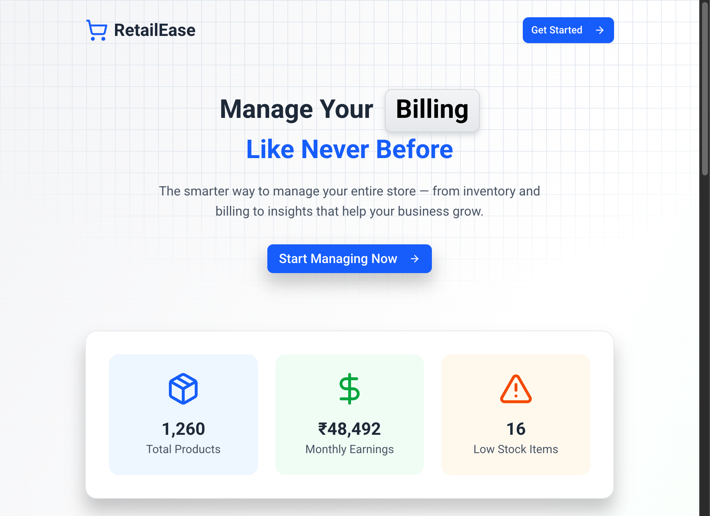

## RetailEase - Your Retail Management Solution (A POS System)

RetailEase is a Nextjs based retail shop management website for small retailers. Built with a modern tech stack, it ensures an easy-to-use, visually appealing, and responsive experience.



## Features

- Inventory management.
- Billing with customer information and printable invoices.
- Dashboard with earnings and sales insights.
- User onboarding and role-based access.
- Settings

## Tech Stack

**Frontend:**

- **Next.js 15.3.3** - React framework with App Router
- **React 19** - UI library with latest features
- **TypeScript** - Type-safe JavaScript
- **Tailwind CSS 4** - Utility-first CSS framework
- **Motion** - Animation library
- **Shadcn/ui** - Pre-built components
- **React Hook Form** - Form management with Zod validation
- **AG Grid** - Advanced data grid for displaying, filtering, and managing tabular data efficiently

**Backend & Database:**

- **MongoDB + Prisma** – Database and ORM layer  
- **Clerk** – Authentication and user management  
- **Next.js API Routes** - Server-side endpoints

## Quickstart

Prerequisites:
- Node.js v18+  
- npm or yarn  
- MongoDB instance (local or cloud, e.g., MongoDB Atlas)  
- Clerk account for authentication  

### Installation
1. Clone the repository:
   
    ```bash
    git clone https://github.com/Siva-555/RetailEase-nextjs.git
    cd retailease
    ```
3. Install dependencies:

    ```bash
    npm install
    ```
5. Set up environment variables in .env:
   
   ```bash
    DATABASE_URL="your_mongodb_connection_string"
    NEXT_PUBLIC_CLERK_PUBLISHABLE_KEY="your_clerk_publishable_key"
    CLERK_SECRET_KEY="your_clerk_secret_key"
   ```
6. Run the development server:
   
   ```bash
   npm run dev
   ```

Open http://localhost:3000
 to view the app.

## 🎥 Project Demo

Watch the project demo on YouTube: [Click Here](https://youtu.be/KQUo8s27KS8)

